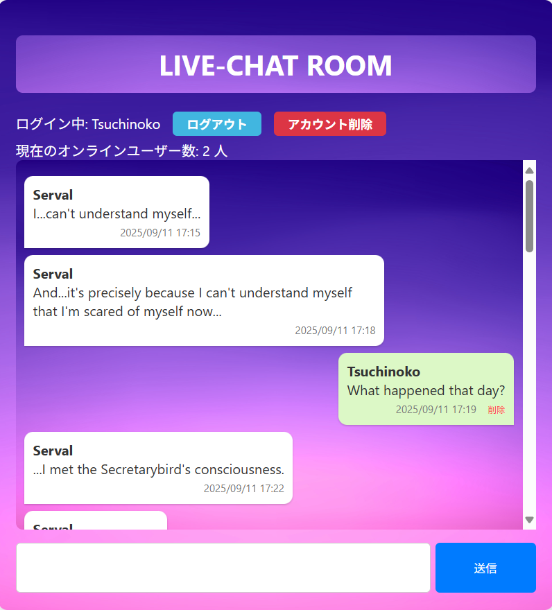
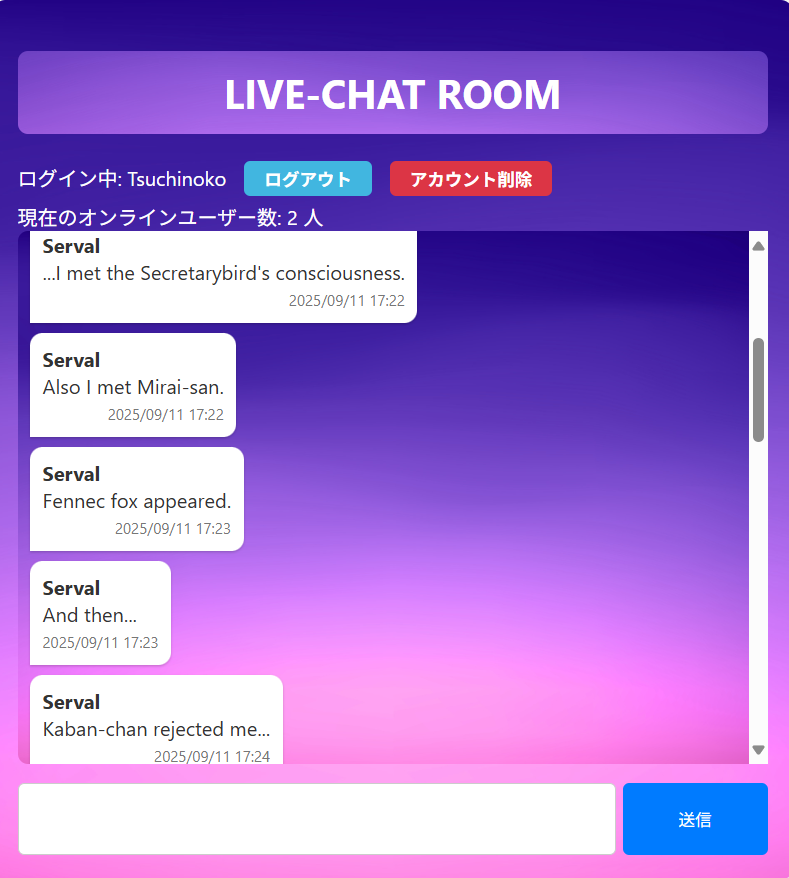
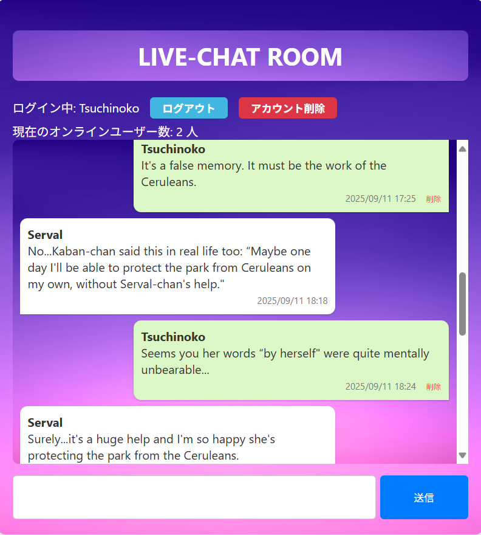
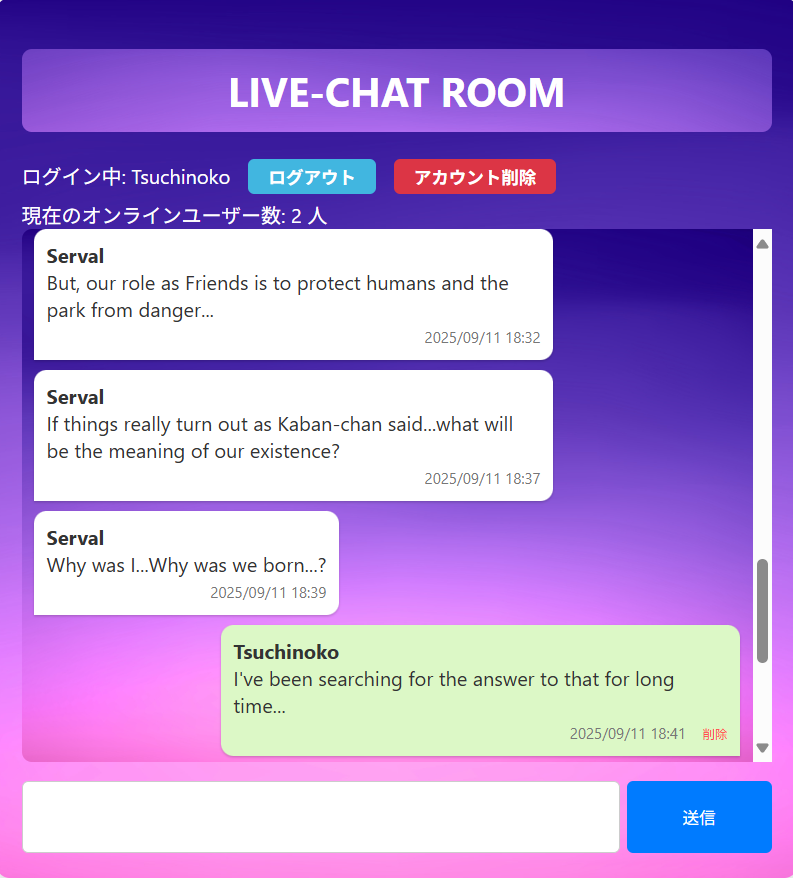
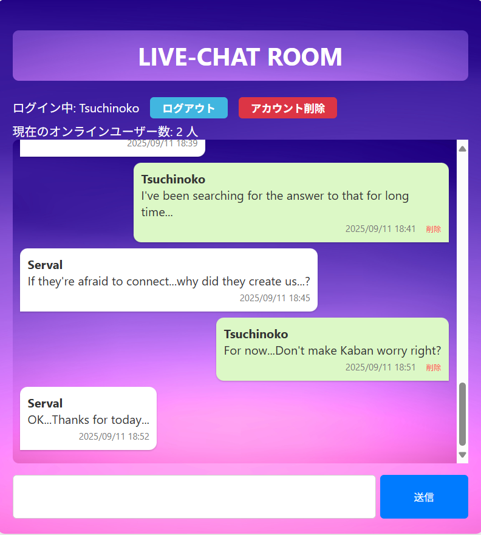

# Webチャットアプリ
**Django** を用いて作成したシンプルなチャットアプリです。











---
## 概要
- ユーザー登録・ログイン機能
- メッセージ投稿機能
- 投稿されたメッセージの一覧表示
- ブラウザ更新による最新メッセージの取得
- ログイン中のみ投稿可能

---

## 🛠️ 動作環境
- Python 3
- Django 4
- SQLite3（標準で利用）

## 🚀 セットアップ手順
1. リポジトリをクローン
   ```bash
   git clone https://github.com/motomasMINO/WebChatApp.git
   cd WebChatApp
   ```

2. 仮想環境を作成・有効化
   ```bash
   python -m venv venv
   source venv/bin/activate  # macOS/Linux
   venv/Scripts/activate     # Windows
   ```

3. 依存パッケージをインストール
   ```bash
   pip install -r requirements.txt
   ```

4. マイグレーション実行
   ```bash
   python manage.py migrate
   ```

5. サーバー起動
   ```bash
   python manage.py runserver
   ```

6. ブラウザーでアクセス
   ```bash
   http://127.0.0.1:8000/
   ```

## 使い方
1. ユーザー登録を行います。
2. ログインするとチャットルームに入室できます。
3. メッセージを入力して投稿すると、他のユーザーにも表示されます。
4. 新しいメッセージを確認する場合は ブラウザの更新ボタンをクリックしてください。

## 今後の拡張アイデア
- Ajax によるメッセージ自動更新
- WebSocket対応（Django Channels）
- メッセージ削除や編集機能
- ルーム機能（複数チャットルーム）

## 📜 ライセンス
このプロジェクトはMIT Licenseのもとで公開されています。

## 📧 お問い合わせ
- GitHub: motomasMINO
- Email: yu120615@gmail.com

  バグ報告や改善点・機能追加の提案はPull RequestまたはIssueで受け付けています!
